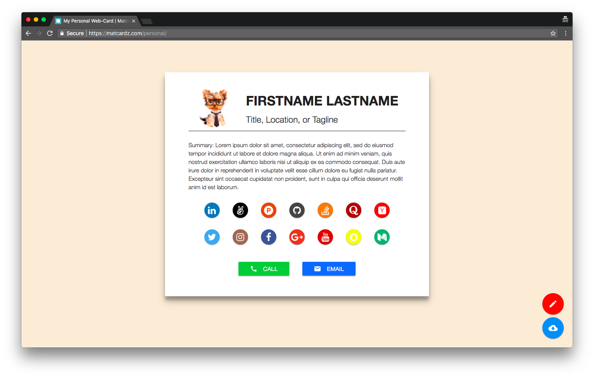

# Material Business Card

This is a HTML business card template perfect for personal websites. Includes picture, name, heading, summary, social buttons, and contact buttons.

## Live

Curently live at [https://thomaswangio.github.io/material-business-card/](https://thomaswangio.github.io/material-business-card/).

## Deployment

Hosted on Github Pages. [Get your own page](https://pages.github.com/)!

## Built With

- [Materialize CSS Framework](http://materializecss.com) - The CSS framework used
- [Font Awesome](https://fontawesome.com) - Font and icon toolkit based on CSS and LESS
- Plain ol' HTML, CSS, and Javascript

## Author

**[Thomas Wang](https://github.com/thomaswangio)**

## License

This project is licensed under the Apache 2.0 License - see the [LICENSE.md](./LICENSE) file for details
